# simple-search
A kind of test assignment with design goals:
 - abstraction (the ability to use the resulting system without knowing all of its internal details) 
 - modularity (the ability to factor the system into smaller, simpler pieces that can be more easily understood 
 and/or replaced with other pieces)

## requirements

The service should work with small documents where each document contains a series of tokens (words). 
To keep things simple document can be represented as String.
 
The usage model of service:
- Put documents into the search engine by key 
- Get document by key 
- Search on a string of tokens to return keys of all documents that contain all tokens in the set

For index persistence we can store documents in server's memory.
 
To keep things simple we can assume that there will be no overwrites of a key with a new document.

We should not use existing tools like Lucene based solution, Sphinx or similar.

Simplest static configuration could be used (no service discovery, replicas, balancing etc.).

## project structure

The test assignment is implemented as Java Maven project with submodules:

- [index-api](./index-api/pom.xml) for base interfaces. Documentation about them is added to JavaDoc
- [index-simple](./index-simple/pom.xml) for simplest (as for me) implementation with in-memory Documents storage 
- [server](./server/pom.xml) is not finally finished yet. It is a Spring Boot REST Server with simple React.JS client

 ## compilation & tests
 
To compile and run tests, please, start a command line at root folder of the project 
(Maven & JDK-8 are required to be installed before) and run:
 ``
 mvn clean install
 ``
 
*NB* : In case you are behind a firewall, please, be sure that your maven settings file `~/.m2/settings.xml`  has
correct [section for proxy](http://maven.apache.org/guides/mini/guide-proxies.html). Such settings
are needed for correct work of NPM managed by [frontend-maven-plugin](https://github.com/eirslett/frontend-maven-plugin)
 

[BDD](https://cucumber.io/) Tests of the project are:

 - [SimpleTokFactoryTest](./index-simple/src/test/resources/SimpleTokFactoryTest.feature):
 To test basic functions of "TokenFactory" & "Tokenizer" (how to split big Document on set of Tokens) 
 - [SimpleVocabularyTest](./index-simple/src/test/resources/SimpleVocabularyTest.feature):
 To test Vocabulary - how it store and manage links between Tokens and Documents
 - [SimpleIndexTest](./index-simple/src/test/resources/SimpleIndexTest.feature): 
 Basically it is a real test of the Index. You can easily play with the feature file and run the test again
 with another test data, it could be funny.
 
 
 The ::SimpleIndexTest:: is enough to check how the Index works even without any GIU application. 
 It is a kind of CLI-test but some more comfortable as for me because it is a "played scenario"
 and you need the only simple text editor to modify test data and repeat the test again.

## starting

Search Server is actually a Spring Boot Application in [server](server) module of the project.
In case you do not use IDE for code review and running of the application I can advise a simple way to start it 
from a command line, it is: 
- open a command line
- navigate with it to a folder with sources of the project
- run maven build by the command  `mvn clean install`. It will take a time because some maven dependencies
could be downloaded and [Node.JS](https://nodejs.org/) && [npm](https://www.npmjs.com/) will also be installed 
to `${user.home}` folder.  I suppose you have permissions to download and install software locally (but I have not 
on my workstation, for example, and direct internet connection missed as well. It cause a lot of issues for me). Otherwise maven build will fail.
- On success of build, please, navigate to sub-folder [server](server) and run `mvn spring-boot:run`
- The Search Server Spring Boot Application will be started on port 8080 and you will see starting logs like this
~~~~
....
[INFO] Scanning for projects...
[INFO]
[INFO] ------------------------------------------------------------------------
[INFO] Building index server 0.0.1-SNAPSHOT
[INFO] ------------------------------------------------------------------------
[INFO]
[INFO] >>> spring-boot-maven-plugin:1.5.4.RELEASE:run (default-cli) > test-compile @ server >>>
Downloading: ....
[INFO]
[INFO] --- spring-boot-maven-plugin:1.5.4.RELEASE:build-info (default) @ server ---
[INFO]
[INFO] --- frontend-maven-plugin:1.6:install-node-and-npm (install node and npm) @ server ---
[INFO] Found proxies: [proxy-https{protocol='https', host='....corp', port=8080}, proxy-http{protocol='https', host='...corp', port=8080}]

[INFO] Node v4.4.5 is already installed.
[INFO] NPM 3.9.2 is already installed.
[INFO]
[INFO] --- frontend-maven-plugin:1.6:npm (npm install) @ server ---
[INFO] Found proxies: [proxy-https{protocol='https', host='...corp', port=8080}, proxy-http{protocol='https', host='....corp', port=8080}]

[INFO] Running 'npm install --https-proxy=http://....corp:8080 --proxy=http://....corp:8080' in ...\simple-search\server
[WARNING] npm WARN optional Skipping failed optional dependency /chokidar/fsevents:
[WARNING] npm WARN notsup Not compatible with your operating system or architecture: fsevents@1.1.3
[INFO]
[INFO] --- frontend-maven-plugin:1.6:webpack (webpack build) @ server ---
[INFO] Running 'webpack.js ' in ...\simple-search\server
[INFO] Hash: bda074b76e75208c2c44
[INFO] Version: webpack 1.15.0
[INFO] Time: 2060ms
[INFO]                                           Asset     Size  Chunks             Chunk Names
[INFO]     ./src/main/resources/static/built/bundle.js   895 kB       0  [emitted]  main
[INFO] ./src/main/resources/static/built/bundle.js.map  1.05 MB       0  [emitted]  main
[INFO]     + 232 hidden modules
[INFO]
[INFO] --- maven-resources-plugin:2.6:resources (default-resources) @ server ---
[INFO] Using 'UTF-8' encoding to copy filtered resources.
[INFO] Copying 6 resources
[INFO]
[INFO] --- maven-compiler-plugin:3.1:compile (default-compile) @ server ---
[INFO] Nothing to compile - all classes are up to date
[INFO]
[INFO] --- maven-resources-plugin:2.6:testResources (default-testResources) @ server ---
[INFO] Using 'UTF-8' encoding to copy filtered resources.
[INFO] skip non existing resourceDirectory ...\simple-search\server\src\test\resources
[INFO]
[INFO] --- maven-compiler-plugin:3.1:testCompile (default-testCompile) @ server ---
[INFO] No sources to compile
[INFO]
[INFO] <<< spring-boot-maven-plugin:1.5.4.RELEASE:run (default-cli) < test-compile @ server <<<
[INFO]
[INFO] --- spring-boot-maven-plugin:1.5.4.RELEASE:run (default-cli) @ server ---
[INFO] Attaching agents: []
Picked up JAVA_TOOL_OPTIONS: -Djavax.net.ssl.trustStore=~\.m2\ptrootca.keystore -Djavax.net.ssl.trustStorePassword=changeit -Dhttp.proxyHost=....corp -Dhttps.proxy
Host=....corp -Dhttp.proxyPort=8080 -Dhttps.proxyPort=8080 -Dhttp.nonProxyHosts=localhost|127.0.0.1|*.corp|*.ptec -Dhttps.nonProxyHosts=localhost|127.0.0.1|*.corp|*.ptec
Ignoring Class-Path entry $hk2-utils.$jar found in ~\.m2\repository\org\glassfish\hk2\hk2\2.5.0-b32\hk2-2.5.0-b32.jar as  ~\.m2\repository\org\glassfish\hk2\hk2\2.5.0-b32\$h
k2-utils.$jar does not exist
Ignoring Class-Path entry $javax.inject.$jar found in ~\.m2\repository\org\glassfish\hk2\hk2\2.5.0-b32\hk2-2.5.0-b32.jar as  ~\.m2\repository\org\glassfish\hk2\hk2\2.5.0-b32
\$javax.inject.$jar does not exist
Ignoring Class-Path entry $hk2-api.$jar found in ~\.m2\repository\org\glassfish\hk2\hk2\2.5.0-b32\hk2-2.5.0-b32.jar as  ~\.m2\repository\org\glassfish\hk2\hk2\2.5.0-b32\$hk2
-api.$jar does not exist
Ignoring Class-Path entry $aopalliance-repackaged.$jar found in ~\.m2\repository\org\glassfish\hk2\hk2\2.5.0-b32\hk2-2.5.0-b32.jar as  ~\.m2\repository\org\glassfish\hk2\hk2
\2.5.0-b32\$aopalliance-repackaged.$jar does not exist
Ignoring Class-Path entry $config-types.$jar found in ~\.m2\repository\org\glassfish\hk2\hk2\2.5.0-b32\hk2-2.5.0-b32.jar as  ~\.m2\repository\org\glassfish\hk2\hk2\2.5.0-b32
\$config-types.$jar does not exist
Ignoring Class-Path entry $hk2-core.$jar found in ~\.m2\repository\org\glassfish\hk2\hk2\2.5.0-b32\hk2-2.5.0-b32.jar as  ~\.m2\repository\org\glassfish\hk2\hk2\2.5.0-b32\$hk
2-core.$jar does not exist
Ignoring Class-Path entry $hk2-config.$jar found in ~\.m2\repository\org\glassfish\hk2\hk2\2.5.0-b32\hk2-2.5.0-b32.jar as  ~\.m2\repository\org\glassfish\hk2\hk2\2.5.0-b32\$
hk2-config.$jar does not exist
Ignoring Class-Path entry $tiger-types.$jar found in ~\.m2\repository\org\glassfish\hk2\hk2\2.5.0-b32\hk2-2.5.0-b32.jar as  ~\.m2\repository\org\glassfish\hk2\hk2\2.5.0-b32\
$tiger-types.$jar does not exist
Ignoring Class-Path entry $hibernate-validator.$jar found in ~\.m2\repository\org\glassfish\hk2\hk2\2.5.0-b32\hk2-2.5.0-b32.jar as  ~\.m2\repository\org\glassfish\hk2\hk2\2.
5.0-b32\$hibernate-validator.$jar does not exist
Ignoring Class-Path entry $validation-api.$jar found in ~\.m2\repository\org\glassfish\hk2\hk2\2.5.0-b32\hk2-2.5.0-b32.jar as  ~\.m2\repository\org\glassfish\hk2\hk2\2.5.0-b
32\$validation-api.$jar does not exist
Ignoring Class-Path entry $jboss-logging.$jar found in ~\.m2\repository\org\glassfish\hk2\hk2\2.5.0-b32\hk2-2.5.0-b32.jar as  ~\.m2\repository\org\glassfish\hk2\hk2\2.5.0-b3
2\$jboss-logging.$jar does not exist
Ignoring Class-Path entry $classmate.$jar found in ~\.m2\repository\org\glassfish\hk2\hk2\2.5.0-b32\hk2-2.5.0-b32.jar as  ~\.m2\repository\org\glassfish\hk2\hk2\2.5.0-b32\$c
lassmate.$jar does not exist
Ignoring Class-Path entry $hk2-locator.$jar found in ~\.m2\repository\org\glassfish\hk2\hk2\2.5.0-b32\hk2-2.5.0-b32.jar as  ~\.m2\repository\org\glassfish\hk2\hk2\2.5.0-b32\
$hk2-locator.$jar does not exist
Ignoring Class-Path entry $javax.inject.$jar found in ~\.m2\repository\org\glassfish\hk2\hk2\2.5.0-b32\hk2-2.5.0-b32.jar as  ~\.m2\repository\org\glassfish\hk2\hk2\2.5.0-b32
\$javax.inject.$jar does not exist
Ignoring Class-Path entry $javassist.$jar found in ~\.m2\repository\org\glassfish\hk2\hk2\2.5.0-b32\hk2-2.5.0-b32.jar as  ~\.m2\repository\org\glassfish\hk2\hk2\2.5.0-b32\$j
avassist.$jar does not exist
Ignoring Class-Path entry $hk2-runlevel.$jar found in ~\.m2\repository\org\glassfish\hk2\hk2\2.5.0-b32\hk2-2.5.0-b32.jar as  ~\.m2\repository\org\glassfish\hk2\hk2\2.5.0-b32
\$hk2-runlevel.$jar does not exist
Ignoring Class-Path entry $class-model.$jar found in ~\.m2\repository\org\glassfish\hk2\hk2\2.5.0-b32\hk2-2.5.0-b32.jar as  ~\.m2\repository\org\glassfish\hk2\hk2\2.5.0-b32\
$class-model.$jar does not exist
Ignoring Class-Path entry $asm-all-repackaged.$jar found in ~\.m2\repository\org\glassfish\hk2\hk2\2.5.0-b32\hk2-2.5.0-b32.jar as  ~\.m2\repository\org\glassfish\hk2\hk2\2.5
.0-b32\$asm-all-repackaged.$jar does not exist
19:30:58.660 [main] DEBUG org.springframework.boot.devtools.settings.DevToolsSettings - Included patterns for restart : []
19:30:58.662 [main] DEBUG org.springframework.boot.devtools.settings.DevToolsSettings - Excluded patterns for restart : [/spring-boot-starter/target/classes/, /spring-boot-autoconfigure/target/classes/
, /spring-boot-starter-[\w-]+/, /spring-boot/target/classes/, /spring-boot-actuator/target/classes/, /spring-boot-devtools/target/classes/]
19:30:58.663 [main] DEBUG org.springframework.boot.devtools.restart.ChangeableUrls - Matching URLs for reloading : [file:/C:/Casino/projects/s13o/simple-search/server/target/classes/]

  .   ____          _            __ _ _
 /\\ / ___'_ __ _ _(_)_ __  __ _ \ \ \ \
( ( )\___ | '_ | '_| | '_ \/ _` | \ \ \ \
 \\/  ___)| |_)| | | | | || (_| |  ) ) ) )
  '  |____| .__|_| |_|_| |_\__, | / / / /
 =========|_|==============|___/=/_/_/_/
 :: Spring Boot ::        (v1.5.4.RELEASE)

2018-02-20 19:30:59.094  INFO 7144 --- [  restartedMain] s13o.test.search.server.SearchServer     : Starting SearchServer on PTUA-LS0657 with PID 7144 (...\simple-search\server\targ
et\classes started by romanso in ...\simple-search\server)
2018-02-20 19:30:59.095  INFO 7144 --- [  restartedMain] s13o.test.search.server.SearchServer     : No active profile set, falling back to default profiles: default
2018-02-20 19:30:59.367  INFO 7144 --- [  restartedMain] ationConfigEmbeddedWebApplicationContext : Refreshing org.springframework.boot.context.embedded.AnnotationConfigEmbeddedWebApplicationContext@18
704af: startup date [Tue Feb 20 19:30:59 EET 2018]; root of context hierarchy
2018-02-20 19:31:00.259  INFO 7144 --- [  restartedMain] o.s.b.f.s.DefaultListableBeanFactory     : Overriding bean definition for bean 'requestContextFilter' with a different definition: replacing [Ro
ot bean: class [null]; scope=; abstract=false; lazyInit=false; autowireMode=3; dependencyCheck=0; autowireCandidate=true; primary=false; factoryBeanName=org.springframework.boot.autoconfigure.jersey.Je
rseyAutoConfiguration; factoryMethodName=requestContextFilter; initMethodName=null; destroyMethodName=(inferred); defined in class path resource [org/springframework/boot/autoconfigure/jersey/JerseyAut
oConfiguration.class]] with [Root bean: class [org.springframework.boot.autoconfigure.web.WebMvcAutoConfiguration$WebMvcAutoConfigurationAdapter]; scope=; abstract=false; lazyInit=false; autowireMode=3
; dependencyCheck=0; autowireCandidate=true; primary=false; factoryBeanName=null; factoryMethodName=requestContextFilter; initMethodName=null; destroyMethodName=(inferred); defined in class path resour
ce [org/springframework/boot/autoconfigure/web/WebMvcAutoConfiguration$WebMvcAutoConfigurationAdapter.class]]
2018-02-20 19:31:00.655  INFO 7144 --- [  restartedMain] f.a.AutowiredAnnotationBeanPostProcessor : JSR-330 'javax.inject.Inject' annotation found and supported for autowiring
2018-02-20 19:31:01.506  INFO 7144 --- [  restartedMain] s.b.c.e.t.TomcatEmbeddedServletContainer : Tomcat initialized with port(s): 8080 (http)
2018-02-20 19:31:01.517  INFO 7144 --- [  restartedMain] o.apache.catalina.core.StandardService   : Starting service [Tomcat]
2018-02-20 19:31:01.518  INFO 7144 --- [  restartedMain] org.apache.catalina.core.StandardEngine  : Starting Servlet Engine: Apache Tomcat/8.5.15
2018-02-20 19:31:01.654  INFO 7144 --- [ost-startStop-1] o.a.c.c.C.[Tomcat].[localhost].[/]       : Initializing Spring embedded WebApplicationContext
2018-02-20 19:31:01.654  INFO 7144 --- [ost-startStop-1] o.s.web.context.ContextLoader            : Root WebApplicationContext: initialization completed in 2289 ms
2018-02-20 19:31:02.185  INFO 7144 --- [ost-startStop-1] o.s.b.w.servlet.ServletRegistrationBean  : Mapping servlet: 's13o.test.search.server.JerseyConfig' to [/api/*]
2018-02-20 19:31:02.187  INFO 7144 --- [ost-startStop-1] o.s.b.w.servlet.ServletRegistrationBean  : Mapping servlet: 'dispatcherServlet' to [/]
2018-02-20 19:31:02.189  INFO 7144 --- [ost-startStop-1] o.s.b.w.servlet.FilterRegistrationBean   : Mapping filter: 'metricsFilter' to: [/*]
2018-02-20 19:31:02.190  INFO 7144 --- [ost-startStop-1] o.s.b.w.servlet.FilterRegistrationBean   : Mapping filter: 'characterEncodingFilter' to: [/*]
2018-02-20 19:31:02.190  INFO 7144 --- [ost-startStop-1] o.s.b.w.servlet.FilterRegistrationBean   : Mapping filter: 'hiddenHttpMethodFilter' to: [/*]
2018-02-20 19:31:02.190  INFO 7144 --- [ost-startStop-1] o.s.b.w.servlet.FilterRegistrationBean   : Mapping filter: 'httpPutFormContentFilter' to: [/*]
2018-02-20 19:31:02.190  INFO 7144 --- [ost-startStop-1] o.s.b.w.servlet.FilterRegistrationBean   : Mapping filter: 'requestContextFilter' to: [/*]
2018-02-20 19:31:02.190  INFO 7144 --- [ost-startStop-1] o.s.b.w.servlet.FilterRegistrationBean   : Mapping filter: 'webRequestLoggingFilter' to: [/*]
2018-02-20 19:31:02.191  INFO 7144 --- [ost-startStop-1] o.s.b.w.servlet.FilterRegistrationBean   : Mapping filter: 'applicationContextIdFilter' to: [/*]
2018-02-20 19:31:02.481  INFO 7144 --- [  restartedMain] s.w.s.m.m.a.RequestMappingHandlerAdapter : Looking for @ControllerAdvice: org.springframework.boot.context.embedded.AnnotationConfigEmbeddedWebA
pplicationContext@18704af: startup date [Tue Feb 20 19:30:59 EET 2018]; root of context hierarchy
2018-02-20 19:31:02.559  INFO 7144 --- [  restartedMain] s.w.s.m.m.a.RequestMappingHandlerMapping : Mapped "{[/]}" onto public java.lang.String s13o.test.search.server.WebController.index()
2018-02-20 19:31:02.560  INFO 7144 --- [  restartedMain] s.w.s.m.m.a.RequestMappingHandlerMapping : Mapped "{[/help]}" onto public java.lang.String s13o.test.search.server.WebController.help()
2018-02-20 19:31:02.563  INFO 7144 --- [  restartedMain] s.w.s.m.m.a.RequestMappingHandlerMapping : Mapped "{[/error]}" onto public org.springframework.http.ResponseEntity<java.util.Map<java.lang.Strin
g, java.lang.Object>> org.springframework.boot.autoconfigure.web.BasicErrorController.error(javax.servlet.http.HttpServletRequest)
2018-02-20 19:31:02.563  INFO 7144 --- [  restartedMain] s.w.s.m.m.a.RequestMappingHandlerMapping : Mapped "{[/error],produces=[text/html]}" onto public org.springframework.web.servlet.ModelAndView org
.springframework.boot.autoconfigure.web.BasicErrorController.errorHtml(javax.servlet.http.HttpServletRequest,javax.servlet.http.HttpServletResponse)
2018-02-20 19:31:02.597  INFO 7144 --- [  restartedMain] o.s.w.s.handler.SimpleUrlHandlerMapping  : Mapped URL path [/webjars/**] onto handler of type [class org.springframework.web.servlet.resource.Re
sourceHttpRequestHandler]
2018-02-20 19:31:02.598  INFO 7144 --- [  restartedMain] o.s.w.s.handler.SimpleUrlHandlerMapping  : Mapped URL path [/**] onto handler of type [class org.springframework.web.servlet.resource.ResourceHt
tpRequestHandler]
2018-02-20 19:31:02.641  INFO 7144 --- [  restartedMain] o.s.w.s.handler.SimpleUrlHandlerMapping  : Mapped URL path [/**/favicon.ico] onto handler of type [class org.springframework.web.servlet.resourc
e.ResourceHttpRequestHandler]
2018-02-20 19:31:03.257  INFO 7144 --- [  restartedMain] o.s.b.a.e.mvc.EndpointHandlerMapping     : Mapped "{[/trace || /trace.json],methods=[GET],produces=[application/vnd.spring-boot.actuator.v1+json
 || application/json]}" onto public java.lang.Object org.springframework.boot.actuate.endpoint.mvc.EndpointMvcAdapter.invoke()
2018-02-20 19:31:03.258  INFO 7144 --- [  restartedMain] o.s.b.a.e.mvc.EndpointHandlerMapping     : Mapped "{[/metrics/{name:.*}],methods=[GET],produces=[application/vnd.spring-boot.actuator.v1+json ||
 application/json]}" onto public java.lang.Object org.springframework.boot.actuate.endpoint.mvc.MetricsMvcEndpoint.value(java.lang.String)
2018-02-20 19:31:03.259  INFO 7144 --- [  restartedMain] o.s.b.a.e.mvc.EndpointHandlerMapping     : Mapped "{[/metrics || /metrics.json],methods=[GET],produces=[application/vnd.spring-boot.actuator.v1+
json || application/json]}" onto public java.lang.Object org.springframework.boot.actuate.endpoint.mvc.EndpointMvcAdapter.invoke()
2018-02-20 19:31:03.259  INFO 7144 --- [  restartedMain] o.s.b.a.e.mvc.EndpointHandlerMapping     : Mapped "{[/info || /info.json],methods=[GET],produces=[application/vnd.spring-boot.actuator.v1+json |
| application/json]}" onto public java.lang.Object org.springframework.boot.actuate.endpoint.mvc.EndpointMvcAdapter.invoke()
2018-02-20 19:31:03.260  INFO 7144 --- [  restartedMain] o.s.b.a.e.mvc.EndpointHandlerMapping     : Mapped "{[/env/{name:.*}],methods=[GET],produces=[application/vnd.spring-boot.actuator.v1+json || app
lication/json]}" onto public java.lang.Object org.springframework.boot.actuate.endpoint.mvc.EnvironmentMvcEndpoint.value(java.lang.String)
2018-02-20 19:31:03.261  INFO 7144 --- [  restartedMain] o.s.b.a.e.mvc.EndpointHandlerMapping     : Mapped "{[/env || /env.json],methods=[GET],produces=[application/vnd.spring-boot.actuator.v1+json ||
application/json]}" onto public java.lang.Object org.springframework.boot.actuate.endpoint.mvc.EndpointMvcAdapter.invoke()
2018-02-20 19:31:03.262  INFO 7144 --- [  restartedMain] o.s.b.a.e.mvc.EndpointHandlerMapping     : Mapped "{[/auditevents || /auditevents.json],methods=[GET],produces=[application/vnd.spring-boot.actu
ator.v1+json || application/json]}" onto public org.springframework.http.ResponseEntity<?> org.springframework.boot.actuate.endpoint.mvc.AuditEventsMvcEndpoint.findByPrincipalAndAfterAndType(java.lang.
String,java.util.Date,java.lang.String)
2018-02-20 19:31:03.262  INFO 7144 --- [  restartedMain] o.s.b.a.e.mvc.EndpointHandlerMapping     : Mapped "{[/dump || /dump.json],methods=[GET],produces=[application/vnd.spring-boot.actuator.v1+json |
| application/json]}" onto public java.lang.Object org.springframework.boot.actuate.endpoint.mvc.EndpointMvcAdapter.invoke()
2018-02-20 19:31:03.263  INFO 7144 --- [  restartedMain] o.s.b.a.e.mvc.EndpointHandlerMapping     : Mapped "{[/heapdump || /heapdump.json],methods=[GET],produces=[application/octet-stream]}" onto publi
c void org.springframework.boot.actuate.endpoint.mvc.HeapdumpMvcEndpoint.invoke(boolean,javax.servlet.http.HttpServletRequest,javax.servlet.http.HttpServletResponse) throws java.io.IOException,javax.se
rvlet.ServletException
2018-02-20 19:31:03.265  INFO 7144 --- [  restartedMain] o.s.b.a.e.mvc.EndpointHandlerMapping     : Mapped "{[/beans || /beans.json],methods=[GET],produces=[application/vnd.spring-boot.actuator.v1+json
 || application/json]}" onto public java.lang.Object org.springframework.boot.actuate.endpoint.mvc.EndpointMvcAdapter.invoke()
2018-02-20 19:31:03.267  INFO 7144 --- [  restartedMain] o.s.b.a.e.mvc.EndpointHandlerMapping     : Mapped "{[/loggers/{name:.*}],methods=[GET],produces=[application/vnd.spring-boot.actuator.v1+json ||
 application/json]}" onto public java.lang.Object org.springframework.boot.actuate.endpoint.mvc.LoggersMvcEndpoint.get(java.lang.String)
2018-02-20 19:31:03.267  INFO 7144 --- [  restartedMain] o.s.b.a.e.mvc.EndpointHandlerMapping     : Mapped "{[/loggers/{name:.*}],methods=[POST],consumes=[application/vnd.spring-boot.actuator.v1+json |
| application/json],produces=[application/vnd.spring-boot.actuator.v1+json || application/json]}" onto public java.lang.Object org.springframework.boot.actuate.endpoint.mvc.LoggersMvcEndpoint.set(java.
lang.String,java.util.Map<java.lang.String, java.lang.String>)
2018-02-20 19:31:03.268  INFO 7144 --- [  restartedMain] o.s.b.a.e.mvc.EndpointHandlerMapping     : Mapped "{[/loggers || /loggers.json],methods=[GET],produces=[application/vnd.spring-boot.actuator.v1+
json || application/json]}" onto public java.lang.Object org.springframework.boot.actuate.endpoint.mvc.EndpointMvcAdapter.invoke()
2018-02-20 19:31:03.268  INFO 7144 --- [  restartedMain] o.s.b.a.e.mvc.EndpointHandlerMapping     : Mapped "{[/autoconfig || /autoconfig.json],methods=[GET],produces=[application/vnd.spring-boot.actuat
or.v1+json || application/json]}" onto public java.lang.Object org.springframework.boot.actuate.endpoint.mvc.EndpointMvcAdapter.invoke()
2018-02-20 19:31:03.269  INFO 7144 --- [  restartedMain] o.s.b.a.e.mvc.EndpointHandlerMapping     : Mapped "{[/configprops || /configprops.json],methods=[GET],produces=[application/vnd.spring-boot.actu
ator.v1+json || application/json]}" onto public java.lang.Object org.springframework.boot.actuate.endpoint.mvc.EndpointMvcAdapter.invoke()
2018-02-20 19:31:03.270  INFO 7144 --- [  restartedMain] o.s.b.a.e.mvc.EndpointHandlerMapping     : Mapped "{[/mappings || /mappings.json],methods=[GET],produces=[application/vnd.spring-boot.actuator.v
1+json || application/json]}" onto public java.lang.Object org.springframework.boot.actuate.endpoint.mvc.EndpointMvcAdapter.invoke()
2018-02-20 19:31:03.270  INFO 7144 --- [  restartedMain] o.s.b.a.e.mvc.EndpointHandlerMapping     : Mapped "{[/health || /health.json],methods=[GET],produces=[application/vnd.spring-boot.actuator.v1+js
on || application/json]}" onto public java.lang.Object org.springframework.boot.actuate.endpoint.mvc.HealthMvcEndpoint.invoke(javax.servlet.http.HttpServletRequest,java.security.Principal)
2018-02-20 19:31:03.397  INFO 7144 --- [  restartedMain] o.s.b.d.a.OptionalLiveReloadServer       : LiveReload server is running on port 35729
2018-02-20 19:31:03.454  INFO 7144 --- [  restartedMain] o.s.j.e.a.AnnotationMBeanExporter        : Registering beans for JMX exposure on startup
2018-02-20 19:31:03.463  INFO 7144 --- [  restartedMain] o.s.c.support.DefaultLifecycleProcessor  : Starting beans in phase 0
2018-02-20 19:31:03.571  INFO 7144 --- [  restartedMain] s.b.c.e.t.TomcatEmbeddedServletContainer : Tomcat started on port(s): 8080 (http)
2018-02-20 19:31:03.586  INFO 7144 --- [  restartedMain] s13o.test.search.server.SearchServer     : Started SearchServer in 4.901 seconds (JVM running for 5.417)
~~~~

## server application

There are two simple web interfaces designed for testing of the Search Server

- First is a React application, (but actually it is not ready yet, sorry). It will be mapped to the "root url" of the 
server [http://localhost:8080/](http://localhost:8080/)
- Second is a [API help](http://localhost:8080/help) page. But it contains small set of java scripts and form controls 
to test the API just from the page

The server will be started with 4 pre-loaded document, the same with used by DBB tests. 
There are some screenshots below.

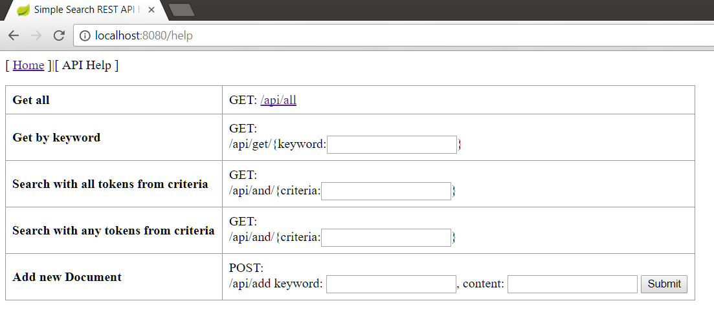

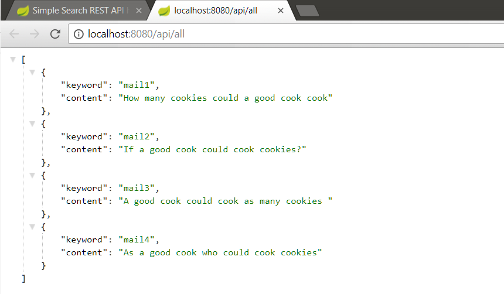

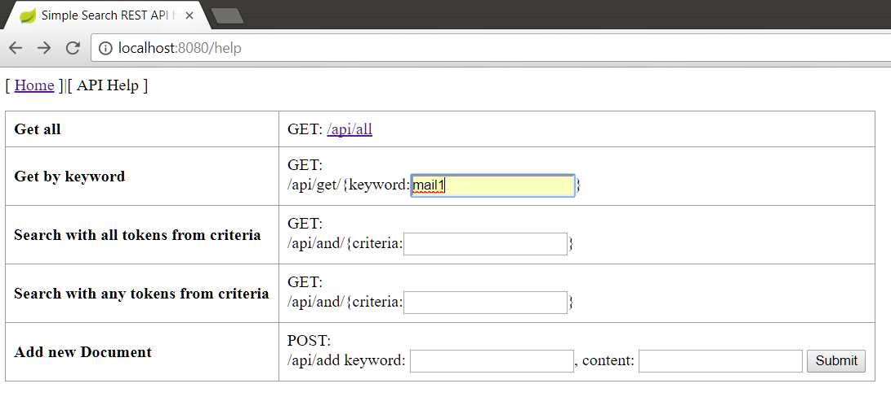

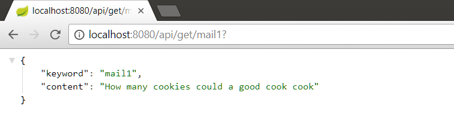

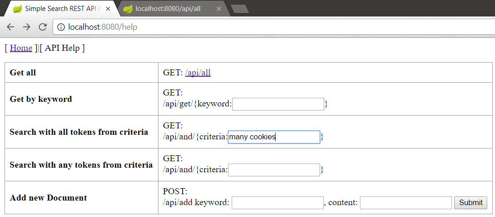

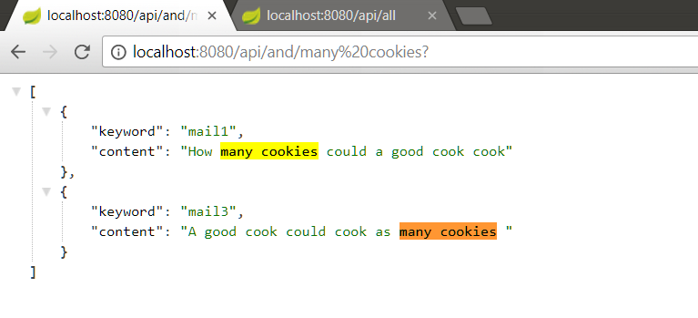

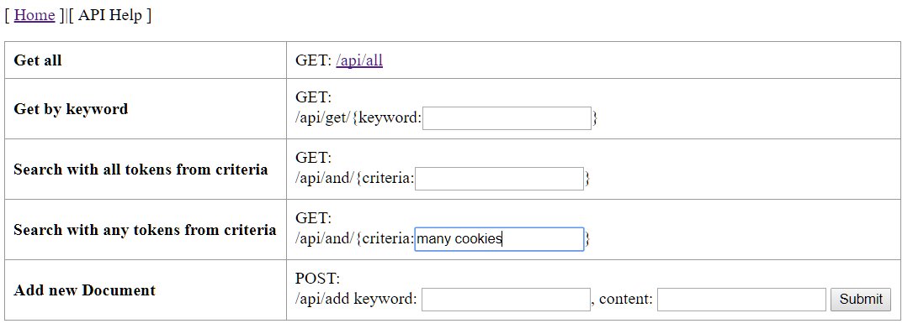

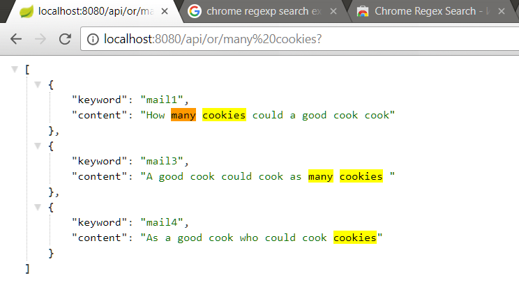

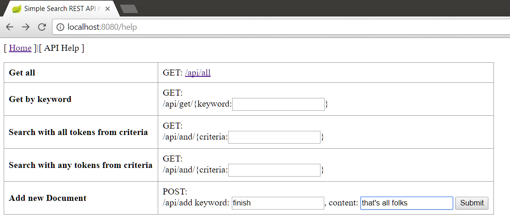

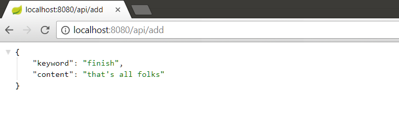

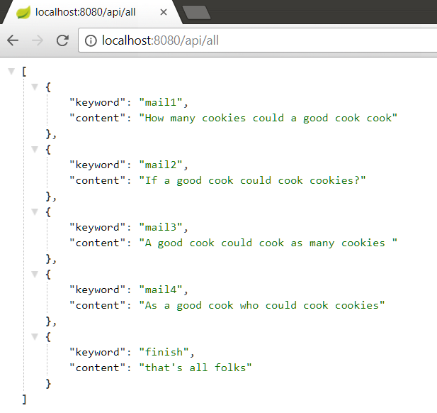
